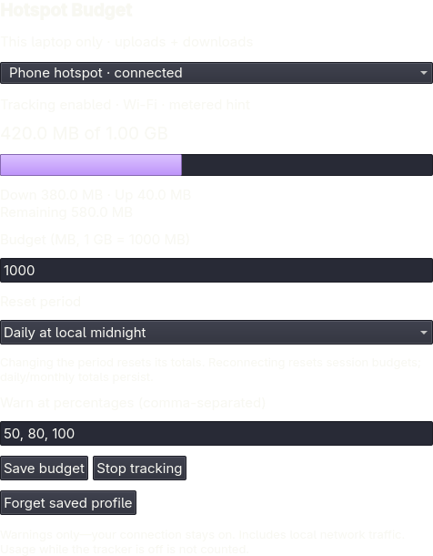

# Data Budget

A local data-budget companion for Omarchy Quattro. Mark a connection once, see
this laptop's upload + download usage in the bar, and receive budget warnings.
The built-in Wi-Fi module continues to handle connections. No phone access,
packet inspection, accounts, analytics, external requests, or root access.



## Features

- Explicitly select connected Wi-Fi or physical Ethernet profiles; USB tethering
  works when NetworkManager exposes a physical Ethernet device.
- Decimal MB budgets; 1000 MB = 1 GB. Session, daily, or calendar-month periods.
- Configurable warning percentages (default 50, 80, 100), coalesced on large jumps.
- One shared tracker across all monitors, with private atomic local persistence.
- Edit saved connections even when offline; stop tracking or forget their data.
- Metered status is a hint only. Never guesses from SSIDs or modifies NM profiles.

Warnings never disconnect the network, throttle traffic, pause programs, or
change the system metered setting. This release has no application integrations.

## Requirements

Omarchy Quattro with the built-in bar or PeekBar,
the standard `omarchy-shell` IPC command, Quickshell, Python 3, `python-gobject`, `libnm`, NetworkManager, and the desktop
notification service. These libraries were available on the development machine;
check your machine with:

```sh
python3 -c "import gi; gi.require_version('NM', '1.0'); from gi.repository import NM"
```

This repository contains no installer, dependency downloader, service unit, or
privileged helper. Dependencies must already be installed. Replacement bars use a narrow local IPC bridge when their shell facade does not
expose plugin services. PeekBar has been checked on the installed desktop.

## Local installation

From this checkout, copy its runtime files into a NEW user plugin directory:

```sh
mkdir -p ~/.config/omarchy/plugins
mkdir ~/.config/omarchy/plugins/sanjyay.hotspot-budget &&
  cp manifest.json Main.qml Service.qml TrackerBridge.qml LICENSE ~/.config/omarchy/plugins/sanjyay.hotspot-budget/ &&
  cp -R scripts ~/.config/omarchy/plugins/sanjyay.hotspot-budget/ &&
  omarchy-shell shell rescanPlugins &&
  omarchy plugin enable sanjyay.hotspot-budget
```

Do not overwrite an existing installation with these instructions. For an update,
first preserve your existing version and follow Omarchy's plugin update workflow.
Publication and marketplace submission have not been performed.

Click the **jar icon**, select your connected network, enter the budget in MB, choose a
period and warning percentages, then **Start tracking**. Budget mode changes reset
the selected profile's totals. Budget-size changes preserve totals and re-arm
warnings. **Stop tracking** retains settings/totals; **Forget saved profile** deletes
them after a second confirming click. An active connection remains selectable
after forgetting, but is no longer tracked.

Daily periods reset at local midnight; monthly periods reset on the first of each
local calendar month. Session periods reset on a new NetworkManager activation
or system boot. Reopening the popup or restarting the shell does not itself reset
the session's saved total. A jar icon fills from bottom to top as usage grows,
using the theme accent and switching to its alert color at 100%. It stays full
above the limit. An empty, dimmed jar means no active connection is tracked;
an exclamation mark means the tracker is unavailable. The icon works in horizontal
and vertical bars. Hover for exact totals and percentages. With multiple active
budgets, the fill shows the highest percentage, not a combined allowance.

## What the number means

**This laptop's interface traffic, not your carrier bill or your phone's total.**

- Uploads and downloads both count, including LAN traffic and protocol overhead.
- Physical interfaces are counted, not VPN/tunnel devices, avoiding double counting.
- Profiles are independent budgets; there is no combined family or carrier plan.
- Polls counters every 2 seconds. A fresh baseline is established after gaps,
  counter resets, connection changes, or calendar boundaries; that interval is
  deliberately uncharged rather than guessed. Very fast reconnects may be missed.
- Tracking requires the shell/plugin to be running. Disabled/offline time is not
  reconstructed. Counters are saved at least every 5 seconds while changing and
  on orderly shutdown; abrupt termination may lose the most recent samples.
- Clock/timezone changes can change calendar periods. No billing-cycle-day support.
- Threshold delivery uses the desktop notification service and respects its DND
  behavior. Markers persist before sending; a crash/delivery failure can omit a
  warning rather than duplicate it. The popup always shows current totals.

## Privacy and removal

Only selected profile UUIDs/names, budget settings, current-period totals,
activation identity and warning markers are stored under
`${XDG_STATE_HOME:-~/.local/state}/hotspot-budget/`. Directory mode is 0700;
files are 0600. Names render as plain text; notifications omit them. No passwords,
URLs, destinations, packet contents, or per-app traffic are collected. Active
connection metadata is read locally from NetworkManager to populate the picker.
This is an ordinary unsandboxed community plugin, not a security boundary.

Disable/remove through Omarchy:

```sh
omarchy plugin disable sanjyay.hotspot-budget
omarchy plugin remove sanjyay.hotspot-budget
```

User usage/settings are retained on removal. To erase them, use Forget before
removal or manually delete ONLY the plugin-specific state directory after disabling.
Do not delete state while a tracker is running. Corrupt/unsupported state is
preserved and tracking fails closed; back it up before repairing it.

## Development

```sh
./tools/check             # isolated tests, host manifest validation, qmllint
./tools/check --portable  # tests without desktop dependencies
```

See [architecture](ARCHITECTURE.md), [security design](docs/security.md), and
[verification](docs/verification.md). MIT licensed; independent community project.
